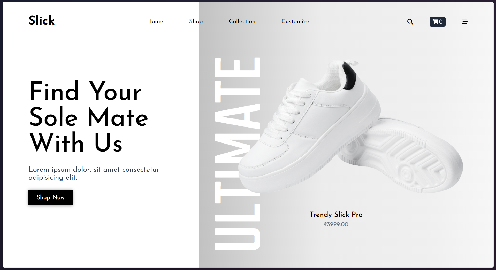
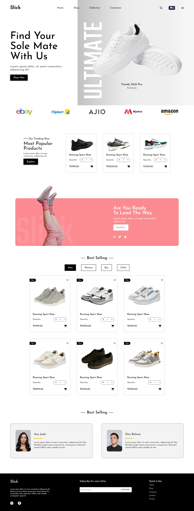

# Slick - Shoe Store Website

Welcome to Slick, a modern and responsive e-commerce website for showcasing and selling stylish shoes. This project was developed using Tailwind CSS to ensure clean, efficient, and customizable design components



## Features

1. Home Page

   - Eye-catching hero section with an elegant tagline: "Find Your Sole Mate With Us".

   - Prominent call-to-action button to encourage users to explore the store.

2. Product Showcase

   - A featured section for trending and best-selling products.

   - Detailed product cards displaying:

   - High-quality shoe images.

   - Product names and prices.

   - Quantity selectors and add-to-cart buttons.

3. Categorized Products

   - Filters for different categories: Men, Women, Boys, and Children.

   - Organized layout for an easy browsing experience.

4. Brand Collaboration

   - Logos of popular partner brands like Amazon, Myntra, Flipkart, and more.

5. Customer Reviews

   - Dedicated section showcasing testimonials from satisfied customers with ratings.

7. Footer Section

   - Links to important pages like Home, Shop, Contact, and Privacy Policy.

   - Newsletter subscription form.

   - Social media links for better engagement.

## Tech Stack

Tailwind CSS: For building responsive and utility-first designs efficiently.

HTML: Structured the content for semantic and accessibility-friendly layouts.

## Installation and usage

1. Clone the repository:

```bash
git clone https://github.com/dhruv1086k/slickShoes.git
```

2. Navigate to the project directory:

```bash
cd slick-shoe-store
```

3. Open the index.html file in your browser to view the website locally.

## Future Enhancements

- Integrate a backend with Node.js and MongoDB for dynamic product management.

- Add a shopping cart and checkout functionality.

- Implement payment gateway integration.

- Include user authentication for a personalized shopping experience.

## 🔗 Links

[](https://dhruv1086k.github.io/dhurvportfolio/)

[](https://linkedin.com/in/dhruv1086k)

## Screenshots


Thank you for visiting Slick! Happy shopping!
